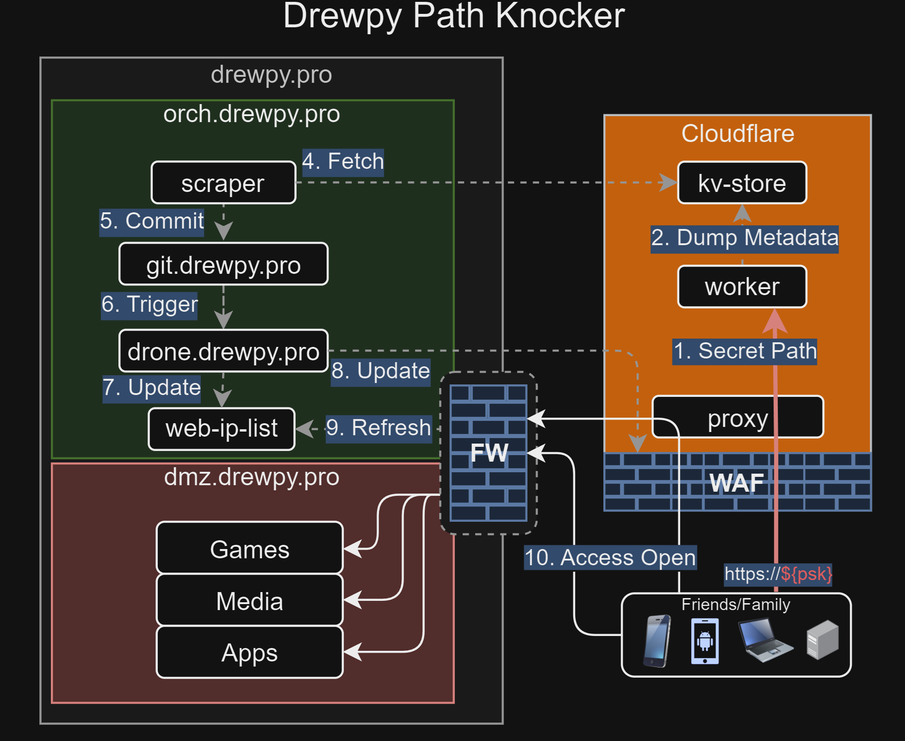

# Drewpy Path Knocker
A dynamic IP whitelisting system using free public cloud resources. Friends and family visit a predetermined URL to register their IP, which propagates to security controls automatically.

## How It Works
1. User vists 'https://id.yourdomain.com/{secret-path}
2. Cloudflare Worker captures their IP and stores in KV
3. On-prem scraper polls KV and pushes to git
4. CI/CD applies changes to WAF + Firewalls
5. User can now access your services (~60s total)

## Why?
- **No User Software** - browser-based registration
- **No recurring costs** - Cloudflare free tier
- **Audit Trail** - git history + webhook alerting
- **Dynamic IPs Supported** - Re-register anytime
- **Hide your VPN Headend** - Minimize VPN headend exposure

## Documentation
- [Architecture Decision Record(ADR)][docs/001-drewpy-path-knocker-adr.md]

## Licensing
- MIT