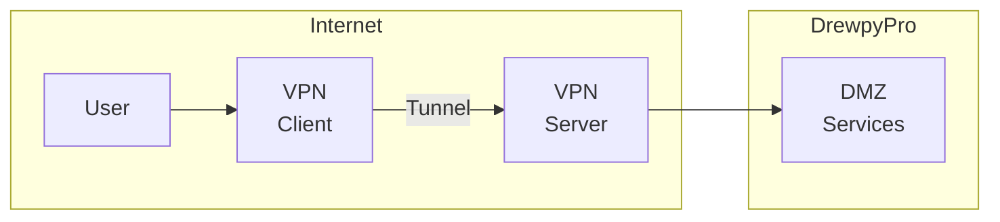
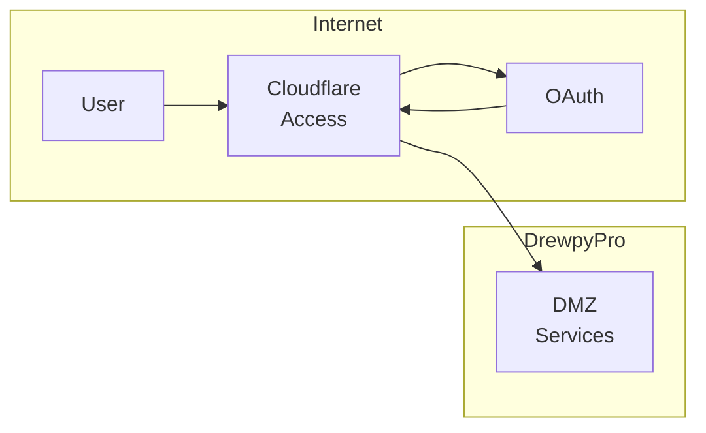
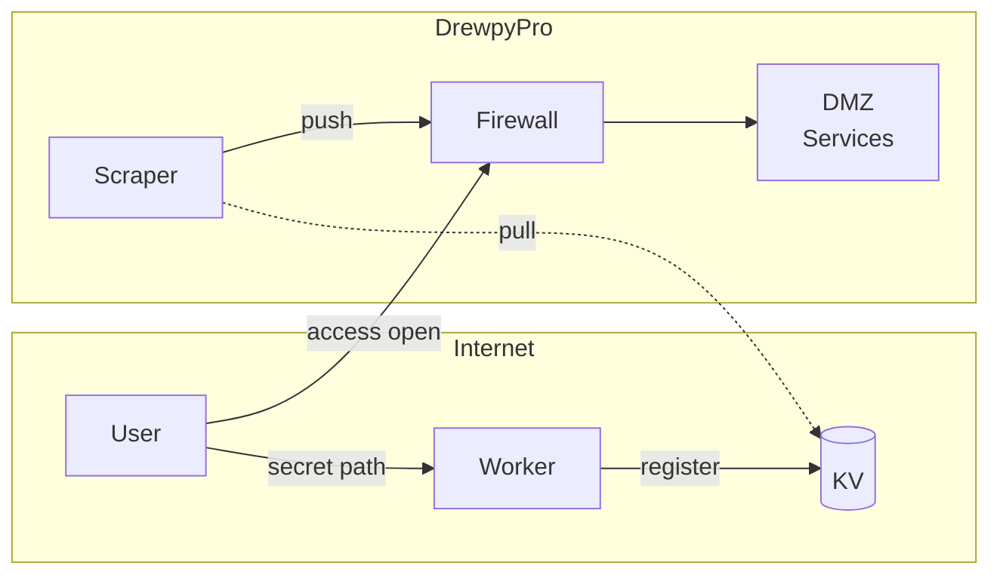
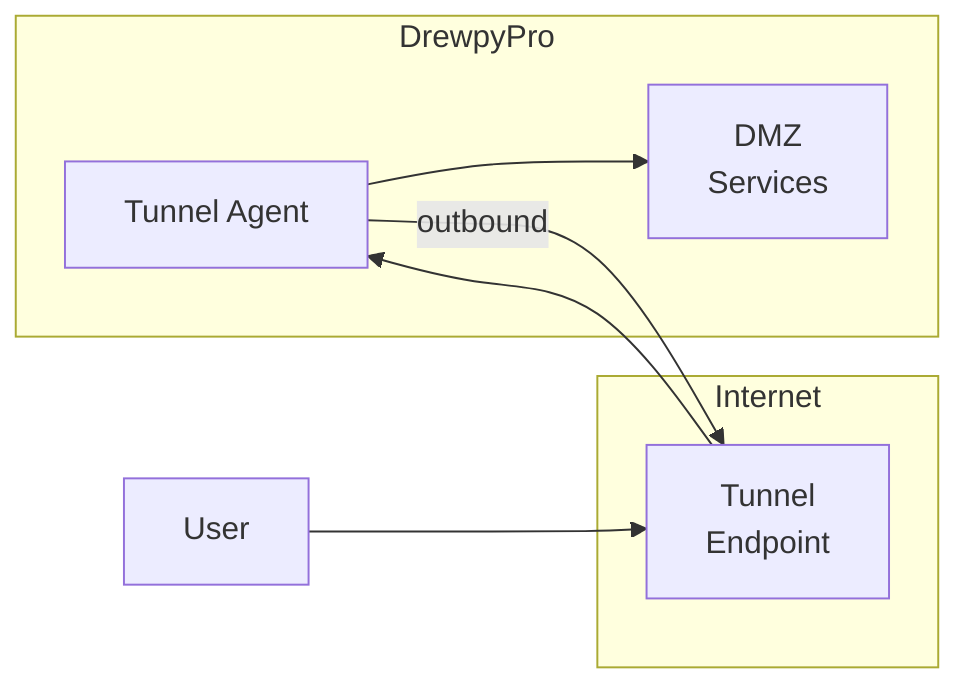

# Drewpy Path Knocker
This document describes the decision for building a URL Path knocker solution using free public cloud resources. 

---

## Problem Statement
- How can I enable trusted dynamic public access to self-hosted services while limiting public exposure and reducing the attack surface?

---

## Context
- Publicly exposed services increase attack surface and personal liability
- Static IP whitelisting fails with dynamic ISP/Mobile networks
- Not all services are web-based (games/media may need direct access)

---

## Decision Drivers
- Free (Cloudflare free tier)
- Security (auditing, privacy, segmentation, threat mitigation)
- UX (browser-based, no software)
- Scalability/Availability
- Learning (CF Workers/KV, TF Providers)
- Extensibility/Reusability

---

## Constraints
- Must work with Cloudflare free tier (KV limits: 100K reads/day, 1K writes/day)
- Requires existing private CI pipeline (Drone, GitHub Actions, etc.)
- No OAuth in initial phase

---

## Options Considered

### Option 1: Client VPN

- **Good**: Secure tunnel access to resources
- **Bad**: Requires publicly exposed VPN server; software install/user support

---

### Option2: Zero Trust Solution (Cloudflare Access)

- **Good**: Catchy buzzwords, Managed solution, identity provider ready-to-go
- **Bad**: $$$, may lack features/controls or increase exposure

---

### Option3: Secret Path Registration
- **Good**: No costs, Limits public exposure, reduces attack surface, satisfies testing goals, gating/auditability
- **Bad**: Complexity, poor reusability

---

### Option4: Egress Reverse Tunnel (Egress-Only)

- **Good**: No direct ingress connectivity, works behind NAT
- **Bad**: May require always-on agent; dependency on thirdparty tunnel provider, $$$, less control over access policy

---

## Decision
Implement custom PSK-based registration using Cloudflare Workers + KV for public registration, with on-prem scraper propagating to firewalls via git/CI pipeline.
- **Benefits**: ~60s whitelisting, no user software, full audit trail, zero cost, foundation for OAuth phase
- **Tradeoffs**: propagation delay, multiple failure points

---